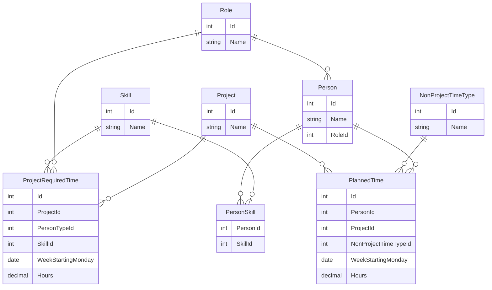

# Buoyancy
Sidecar app for [Float](float.com) which answers the questions:
- Are all projects fully resourced?
- What are some good options to better use the resources I have?
- What additional resources do I need to fully resource all projects?

# Resource Types & Skills
- Tech lead
- Front end developer
    - React
    - Angular
    - Vue
- Back end developer
    - .Net
- Full stack developer
    - All FE and BE skills
    - Ruby on rails
- Mobile developer
    - Flutter
- Dev Ops
    - Azure Dev Ops
    - AWS Dev Ops
- Designer
- Tester
- Project manager

# Data model

# User Stories
### Bulk load and view exported float schedule data
Columns:
- Name (person)
- Project
- Time off - e.g. "Annual Leave"
- DateColumn(s)

Upsert people and projects.

### Assign users skills and types
- View existing people (upserted via bulk float upload).
- Set type against an existing person.
- Add 1 or more skills to an existing person.

### View projects and required time
- View existing projects (upserted via bulk float upload).
- View existing required time for projects (chip per resource type in table view).

### Add required time
- Add single required time.
- Delete single required time.
- Add range of required time.

### Basic report of total required time vs planned time
Show total planned vs required time per week. Highlight over and under resourced project weeks. Chip for each type of person. Red text if over / under resourced.

### Report skill warnings
Show where planned person does not have required skill.

### Add project onboarding time
Add project onboarding time (modeled as non-project time).